Nama : Lailatul Sofia
NIM : 60324027
Mata Kulaih : Pemograman Web II

---

## Tugas 1 — Query Eksplorasi

### A. Statistik Buku

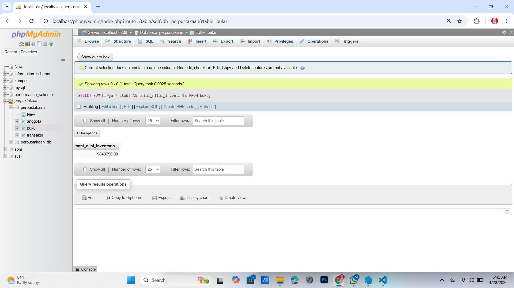
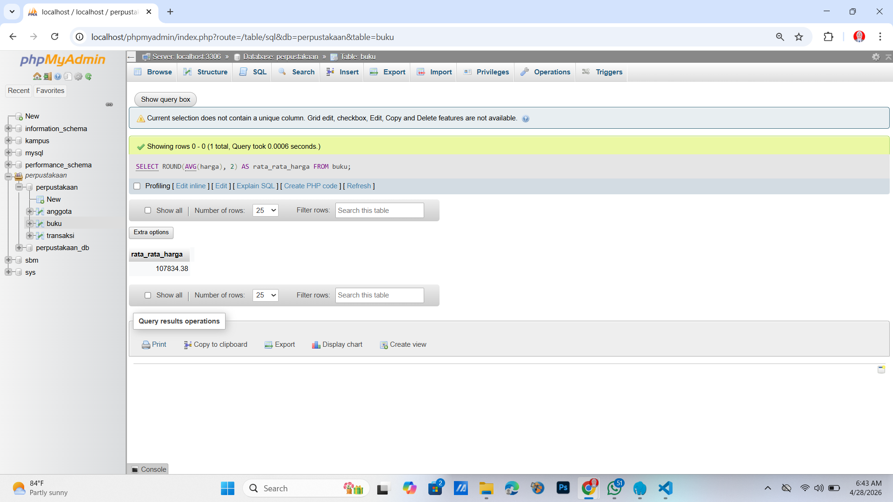

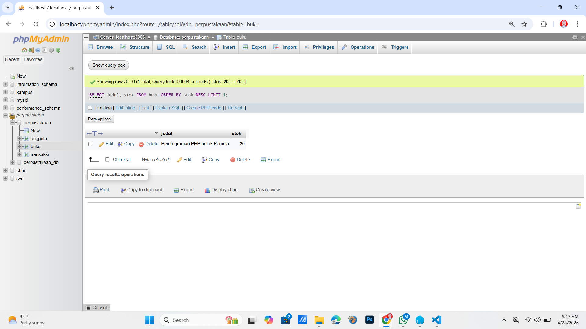

### B. Filter dan Pencarian

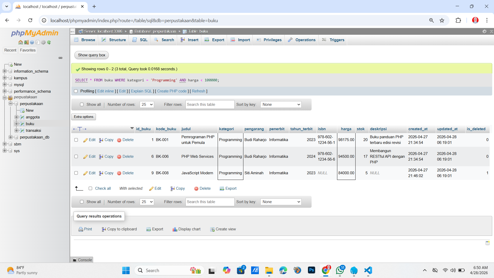
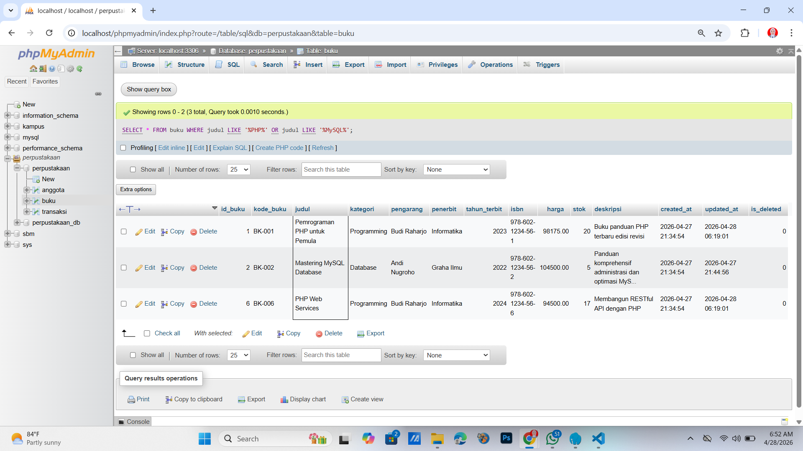
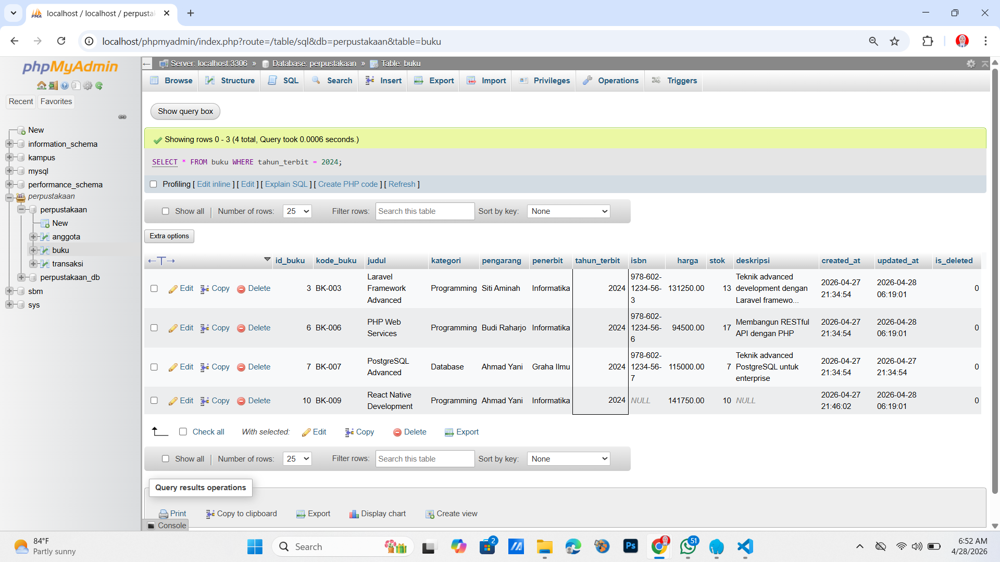
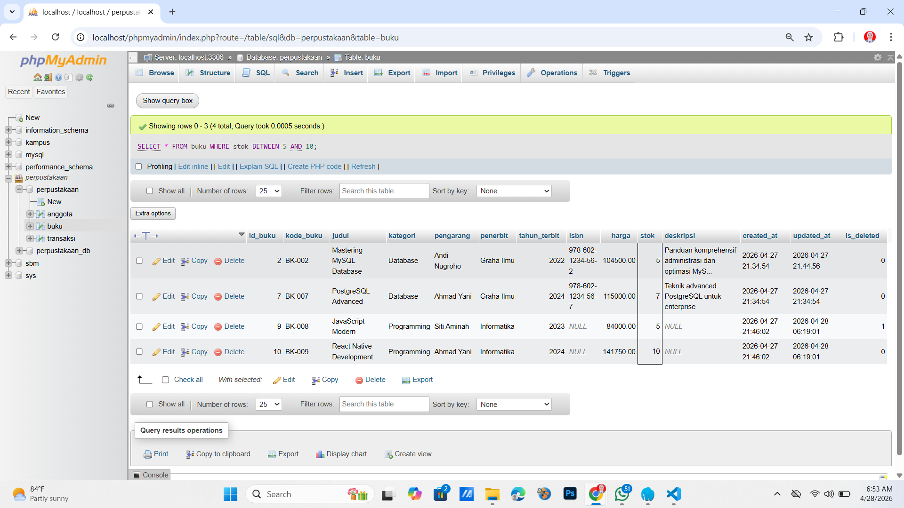
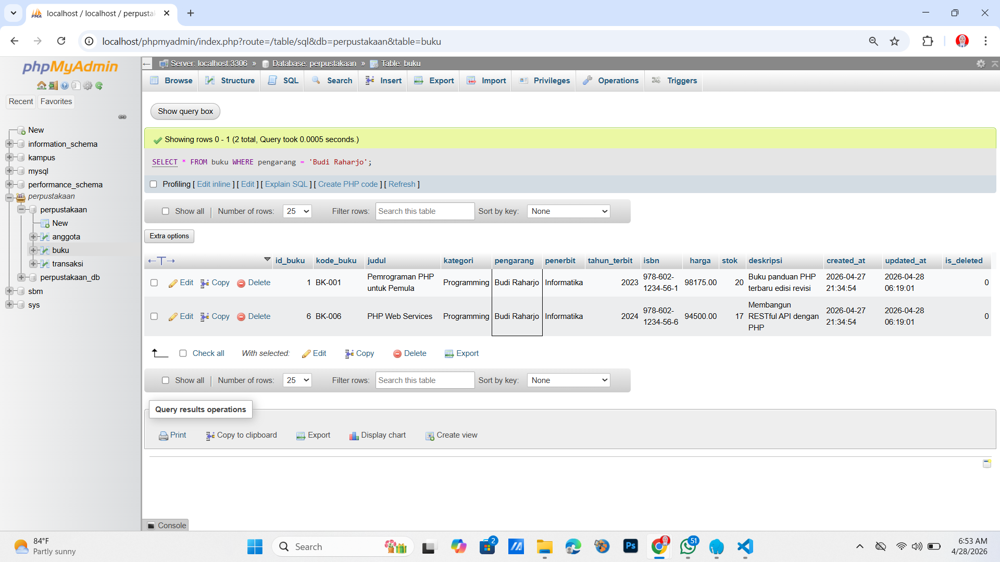

### C. Grouping dan Agregasi

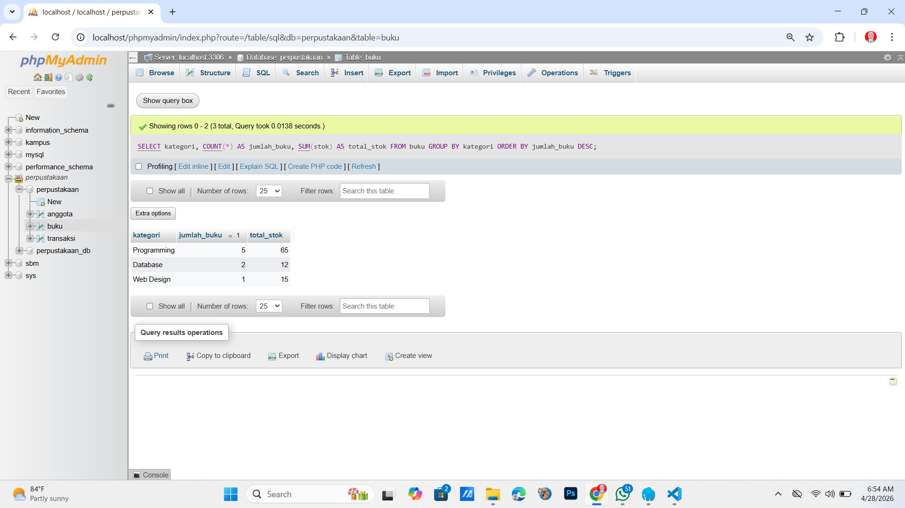
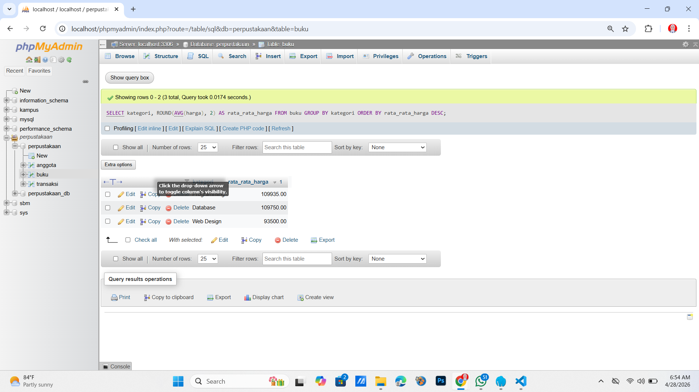
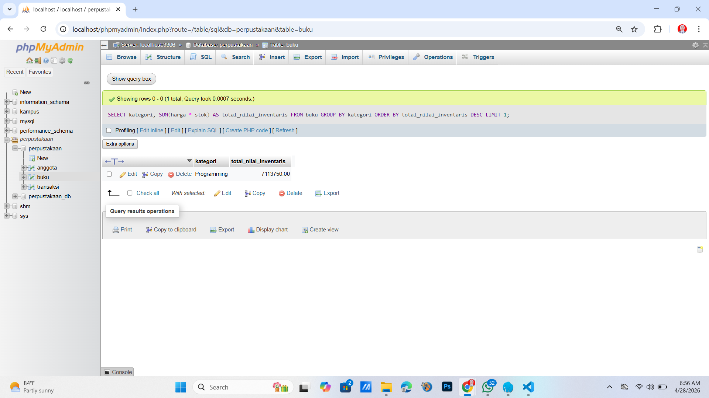

### D. Update Data

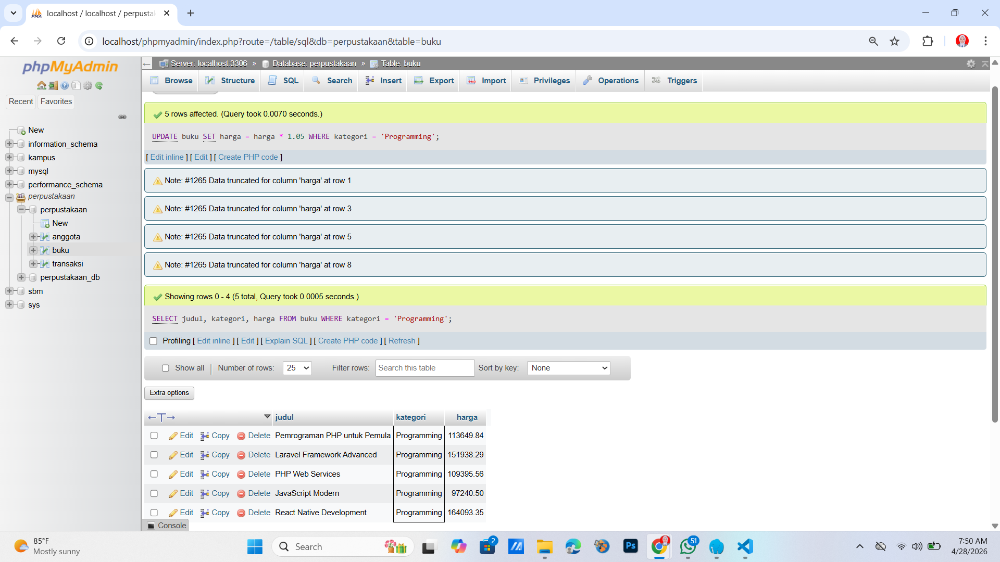
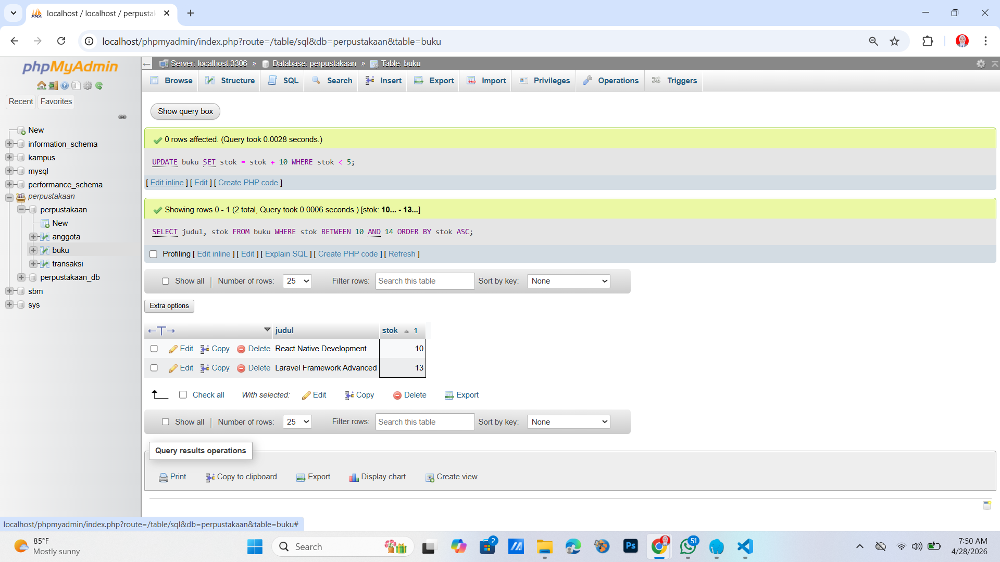

### E. Laporan Khusus

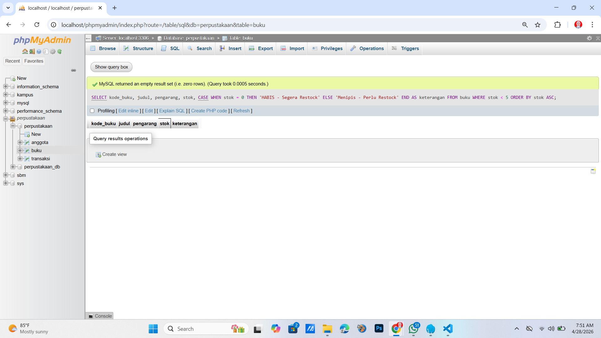
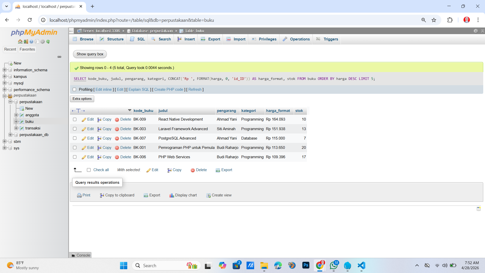

---

## Tugas 2 — Desain Database Lengkap

### Data Setiap Tabel

.png>)
.png>)
.png>)
.png>)
.png>)
.png>)

### Hasil Query JOIN

